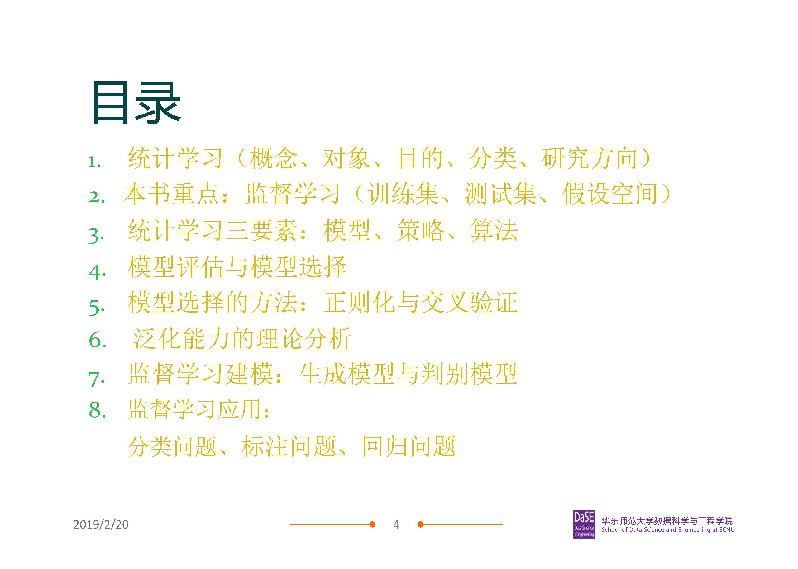

【[Home](https://simplelp.github.io/) | [GitHub](https://github.com/SimpleLP/MachineLearning)】     
本模块整理机器学习相关内容，涉及机器学习方法的核心想法、数学推导与代码实践      

-------------------------------------------------

# 理论内容
## 1. 统计学习方法概论
提纲： 
  
PDF讲义笔记：[slide1](slide1.pdf)  
拓展阅读：             
(3) 《机器学习》第一章、第二章            
(4) “机器学习” P1 ~ P9              

------------------------------------------------

# 实践内容

--------------------------------------------------

# 参考资料
[机器学习课程主页](http://58.198.176.86/qwdong/machinelearning/)，董启文老师讲授         
《统计学习方法》，李航著        
《机器学习》， 周志华著        
《模式识别与机器学习》， 马春鹏译      
[机器学习](https://www.bilibili.com/video/av10590361?from=search&seid=3689001450384077781)， 李宏毅 &emsp;  [ [课程主页](http://speech.ee.ntu.edu.tw/~tlkagk/courses_ML17_2.html) ]    
