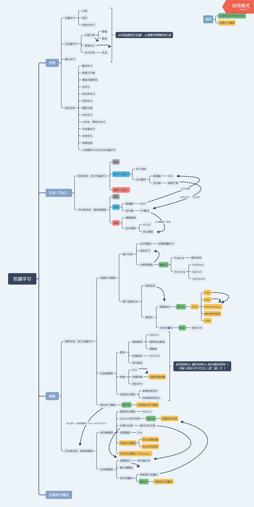

**教材:**
- [神经网络与深度学习](https://nndl.github.io/)，[邱锡鹏](https://xpqiu.github.io/)老师著

**视频资料:**
- [机器学习与深度学习系列](http://speech.ee.ntu.edu.tw/~tlkagk/courses.html)，[李宏毅](http://speech.ee.ntu.edu.tw/~tlkagk/index.html)老师
- [白板推导系列](https://github.com/shuhuai007/Machine-Learning-Session)

**备注：**
- 视频资料在B站均有公布，感谢几位老师的分享！

| 章节      |    补充资料 |  课后习题 |
| :-------- | :--------|:---- |
| **第一部分 入门篇**  | ||
| 第1章 绪论  |  |    | 
| 第2章 机器学习概述|李: [Intro2017](http://speech.ee.ntu.edu.tw/~tlkagk/courses_ML17_2.html), [Intro2019](http://speech.ee.ntu.edu.tw/~tlkagk/courses_ML19.html), [Where does the error come from?](http://speech.ee.ntu.edu.tw/~tlkagk/courses_ML17_2.html), [Regression](http://speech.ee.ntu.edu.tw/~tlkagk/courses_ML17_2.html), [Gradient Descent](http://speech.ee.ntu.edu.tw/~tlkagk/courses_ML17_2.html)  白：[开篇](https://github.com/shuhuai007/Machine-Learning-Session), [线性回归](https://github.com/shuhuai007/Machine-Learning-Session) | | 
|第3章 线性模型 |李: [Probabilistic Generative Model](http://speech.ee.ntu.edu.tw/~tlkagk/courses_ML17_2.html), [Logistic Regression](http://speech.ee.ntu.edu.tw/~tlkagk/courses_ML17_2.html), [SVM](http://speech.ee.ntu.edu.tw/~tlkagk/courses_ML16.html) 白：[线性分类](https://github.com/shuhuai007/Machine-Learning-Session), [SVM](https://github.com/shuhuai007/Machine-Learning-Session), [核方法](https://github.com/shuhuai007/Machine-Learning-Session) | | 
| **第二部分 基础模型**  | ||
| 第4章 前馈神经网络  | 李: [ Introduction of Deep Learning](http://speech.ee.ntu.edu.tw/~tlkagk/courses_ML17_2.html), [Backpropagation](http://speech.ee.ntu.edu.tw/~tlkagk/courses_ML17_2.html), [Computational Graph](http://speech.ee.ntu.edu.tw/~tlkagk/courses_MLDS18.html), [“Hello world” of deep learning](http://speech.ee.ntu.edu.tw/~tlkagk/courses_ML17_2.html) 白：[前馈神经网络](https://www.bilibili.com/video/av40204935) 其他：[Backprop by Google](https://google-developers.appspot.com/machine-learning/crash-course/backprop-scroll/), [GNN](http://snap.stanford.edu/proj/embeddings-www/)|     | 
| 第5章 卷积神经网络  | 李: [Convolutional Neural Network](http://speech.ee.ntu.edu.tw/~tlkagk/courses_ML17_2.html), [Why Deep](http://speech.ee.ntu.edu.tw/~tlkagk/courses_ML17_2.html), [Why Deep Structure?](http://speech.ee.ntu.edu.tw/~tlkagk/courses_MLDS18.html)  |     | 
| 第6章 循环神经网络  | 李: [Recurrent Neural Network](http://speech.ee.ntu.edu.tw/~tlkagk/courses_ML17_2.html), [Recursive Network](http://speech.ee.ntu.edu.tw/~tlkagk/courses_MLDS18.html), [Highway Network & Grid LSTM](http://speech.ee.ntu.edu.tw/~tlkagk/courses_MLDS17.html)  |     | 
| 第7章 网络优化与正则化   |李: [Tips for deep learning](http://speech.ee.ntu.edu.tw/~tlkagk/courses_ML17_2.html), [Optimization](http://speech.ee.ntu.edu.tw/~tlkagk/courses_MLDS18.html), [Special Training Technology](http://speech.ee.ntu.edu.tw/~tlkagk/courses_MLDS18.html)  其他：[Batch Normalization分析](https://spaces.ac.cn/archives/6992)  |     | 
| 第8章 注意力机制与外部记忆  |李: [Attention-based Model](http://speech.ee.ntu.edu.tw/~tlkagk/courses_MLDS18.html), [Attention is all you need](https://arxiv.org/pdf/1706.03762.pdf), [Pointer Network](http://speech.ee.ntu.edu.tw/~tlkagk/courses_MLDS18.html)   |     | 
| 第9章 无监督学习  | 李: [Unsupervised Learning](http://speech.ee.ntu.edu.tw/~tlkagk/courses_ML17_2.html), [More Auto-encoder ](http://speech.ee.ntu.edu.tw/~tlkagk/courses_ML19.html) 白：[降维](https://github.com/shuhuai007/Machine-Learning-Session), [谱聚类](https://space.bilibili.com/97068901/dynamic)|     | 
| 第10章 模型独立的学习方法  | 李: [Ensemble](http://speech.ee.ntu.edu.tw/~tlkagk/courses_ML17_2.html), [Semi-supervised Learning](http://speech.ee.ntu.edu.tw/~tlkagk/courses_ML17_2.html), [Transfer Learning](http://speech.ee.ntu.edu.tw/~tlkagk/courses_ML17_2.html), [Life-long learning](http://speech.ee.ntu.edu.tw/~tlkagk/courses_ML19.html), [Meta Learning](http://speech.ee.ntu.edu.tw/~tlkagk/courses_ML19.html) 其他：[王晋东GitHub](https://github.com/jindongwang), [Semi-supervised Learning](https://www.cs.utah.edu/~piyush/teaching/8-11-slides.pdf), [Self-Taught Learning](https://www3.nd.edu/~rjohns15/cse40647.sp14/www/content/lectures/34%20-%20Self-Taught%20Learning.pdf)|     | 
| **第三部分 进阶模型**  | ||
| 第11章 概率图模型  |李: [Graphical Model, Gibbs Sampling](http://speech.ee.ntu.edu.tw/~tlkagk/courses_MLSD15_2.html), [Markov Logic Network](http://speech.ee.ntu.edu.tw/~tlkagk/courses_MLSD15_2.html), [Structured Learning](http://speech.ee.ntu.edu.tw/~tlkagk/courses_ML16.html), [SVM^struct](http://speech.ee.ntu.edu.tw/~tlkagk/courses_MLSD15_2.html), [Learning with Hidden Information](http://speech.ee.ntu.edu.tw/~tlkagk/courses_MLSD15_2.html) 白：[指数族分布](https://github.com/shuhuai007/Machine-Learning-Session), [概率图模型](https://github.com/shuhuai007/Machine-Learning-Session), [EM](https://github.com/shuhuai007/Machine-Learning-Session), [EM2](https://space.bilibili.com/97068901/dynamic), [GMM](https://github.com/shuhuai007/Machine-Learning-Session), [HMM](https://github.com/shuhuai007/Machine-Learning-Session), [CRF](https://github.com/shuhuai007/Machine-Learning-Session), [VI](https://github.com/shuhuai007/Machine-Learning-Session), [VI2](https://space.bilibili.com/97068901/dynamic), [MCMC](https://github.com/shuhuai007/Machine-Learning-Session)  |     | 
| 第12章 深度信念网络  |李: [受限玻尔兹曼机、深度信念网络参考资料](http://speech.ee.ntu.edu.tw/~tlkagk/courses/ML_2017/Lecture/auto.pdf) 白：[受限玻尔兹曼机](https://github.com/shuhuai007/Machine-Learning-Session) |     | 
| 第13章 深度生成模型  |李: [Deep Generative Model](http://speech.ee.ntu.edu.tw/~tlkagk/courses_ML17_2.html), [Generative Adversarial Network](http://speech.ee.ntu.edu.tw/~tlkagk/courses_MLDS18.html), [Adversarial Attack](http://speech.ee.ntu.edu.tw/~tlkagk/courses_ML19.html)  其他：[CS228 VAE](https://ermongroup.github.io/cs228-notes/extras/vae/), [科学空间 VAE系列](https://spaces.ac.cn/archives/5253) |     | 
| 第14章 深度强化学习 |李: [Deep Reinforcement Learning](http://speech.ee.ntu.edu.tw/~tlkagk/courses_ML17_2.html), [Deep Reinforcement Learning2](http://speech.ee.ntu.edu.tw/~tlkagk/courses_MLDS18.html)   |     | 
| 第15章 序列生成模型  |李: [Word Embedding](http://speech.ee.ntu.edu.tw/~tlkagk/courses_ML17_2.html), [Sequence-to-sequence and Attention](http://speech.ee.ntu.edu.tw/~tlkagk/courses_ML17_2.html), [Transformer](http://speech.ee.ntu.edu.tw/~tlkagk/courses_ML19.html), [BERT](http://speech.ee.ntu.edu.tw/~tlkagk/courses_ML19.html), [Seq-to-seq Learning by CNN](https://arxiv.org/pdf/1705.03122.pdf), [Spatial Transformer Layer](http://speech.ee.ntu.edu.tw/~tlkagk/courses_MLDS17.html) 其他：[The Annotated Transformer](http://nlp.seas.harvard.edu/2018/04/03/attention.html), [The Illustrated Transformer](https://jalammar.github.io/illustrated-transformer/) |     | 
| **附录**  |白：[数学基础](https://github.com/shuhuai007/Machine-Learning-Session) 3BlueBrown：[线性代数的本质](https://www.bilibili.com/video/av44855426)  ||

补充：
- [Anomaly Detection](http://speech.ee.ntu.edu.tw/~tlkagk/courses_ML19.html)
- [Explainable ML](http://speech.ee.ntu.edu.tw/~tlkagk/courses_ML19.html)
- [Network Compression](http://speech.ee.ntu.edu.tw/~tlkagk/courses_ML19.html)
- [Matrix Factorization](http://speech.ee.ntu.edu.tw/~tlkagk/courses_ML17.html)
- [Flow](http://speech.ee.ntu.edu.tw/~tlkagk/courses_ML19.html)
- [Generalization](http://speech.ee.ntu.edu.tw/~tlkagk/courses_MLDS18.html)
- [卡曼滤波](https://github.com/shuhuai007/Machine-Learning-Session)
- [粒子滤波](https://github.com/shuhuai007/Machine-Learning-Session)
- [高斯网络](https://github.com/shuhuai007/Machine-Learning-Session)
- [贝叶斯线性回归](https://github.com/shuhuai007/Machine-Learning-Session)
- [高斯过程回归](https://github.com/shuhuai007/Machine-Learning-Session)

**News:**
- 2019/10/25：根据目前学的内容，整理了一份机器学习主干知识的统一架构，还没有完全梳理好（尤其是强化学习与概率图模型部分），但是最基本的架构已经确定了，分享出来供大家参考，后面我会继续调整，并做出必要的解释，有疑问或建议欢迎Issue！

- 2019/11/01: 推荐李宏毅老师的 “[深度学习的终结者](DL_Mythbusters.pdf)” 系列研究课题，会让你对各种模型有更深入的理解，完成的话应该能够算是中级选手了，这份资料也是自己后面学习的重点，一起加油！

--------------------------------------------------

# 推荐资料

**入门**
- [Google: Machine Learning Crash Course](https://developers.google.com/machine-learning/crash-course/)
- [Neural Networks and Deep Learning, Michael Nielsen](http://neuralnetworksanddeeplearning.com/)

**基础**
- 《机器学习》， 周志华著；
- 《统计学习方法（第二版）》，李航著 &emsp;[[知乎参考读物](https://zhuanlan.zhihu.com/p/36378498)]  
- 《模式识别与机器学习》， 马春鹏译
  - [机器学习, 白板推导系列](https://github.com/shuhuai007/Machine-Learning-Session)&emsp;[Note](https://github.com/ws13685555932/machine_learning_derivation) 
- 《深度学习》，Lan Goodfellow等著
    - [CMU Introduction to Deep Learning](http://deeplearning.cs.cmu.edu/)
- 《概率图模型：原理与技术》Daphne Koller著
    - [CMU 10-708: Probabilistic Graphical Models](https://sailinglab.github.io/pgm-spring-2019/)
    - [Stanford CS228: Probabilistic Graphical Model](https://cs228.stanford.edu/)

- [CS224W: Machine Learning with Graphs](http://web.stanford.edu/class/cs224w/)

**进阶**
- [NN4ML](https://www.bilibili.com/video/av9838961?from=search&seid=12389028944234946948),Hinton
- [Stat212b: Topics Course on Deep Learning](http://joanbruna.github.io/stat212b/), Joan Bruna(Yann LeCun 博士后)
- [NYU: MACHINE LEARNING](https://davidrosenberg.github.io/ml2019/#resources?utm_source=wechat_session&utm_medium=social&utm_oi=844207196790202368&nsukey=rb5HTvIlGMlnGJ1rCFoqoQomgMOhQe0J00cRZsoLPJxGfWlAVSCxkFUqVHPdpGpSdkcnAH8y9ApeFvaNGir2znHWUe61CH4RyX79R8oqq8CmqWiL3ZbZfuDvSScXl7C8zcXlGVaErk1kRQewyHY8j%2Bee3yq1zuoQ8GagBtKnKdw%3D)
- [Materials for Deep Learning](https://github.com/nndl/materials-for-deep-learning), FudanNLP
- [Stanford CS236: Deep Generative Models](https://deepgenerativemodels.github.io/) 

**附加资料**
- [NNDL课程作业](https://github.com/nndl/exercise), 还没有整理好，建议后期练习
- [AI算法工程师笔记](http://www.huaxiaozhuan.com/)
- [CS229](http://cs229.stanford.edu/syllabus.html)，主要看NOTES与最新论文
- [36-708 Statistical Methods for Machine Learning](http://www.stat.cmu.edu/~larry/=sml/)
- CMU 10-715 Advanced Introduction to Machine Learning
- 《Machine Learning：A Probabilistic Perspective》 
- 《[An Introduction to Statistical Learning](http://www-bcf.usc.edu/~gareth/ISL/)》
  - [Stanford Lagunita: Statistical Learning](https://lagunita.stanford.edu/courses/HumanitiesSciences/StatLearning/Winter2016/about)
  - [UCB: Introduction to Machine Learning](https://people.eecs.berkeley.edu/~jrs/189/)
- 《The Elements of Statistical Learning》
- 其他：机器学习、深度学习，吴恩达；统计机器学习、机器学习导论，张志华；机器学习（各距离之间的关系）、深度学习，邹博；机器学习，徐亦达；机器学习基础、机器学习技法，林轩田；[慕课网：Python3玩转机器学习](https://coding.imooc.com/class/169.html)

------------------------------------------------------------

This page maintained by @ <a href="https://dasepeng.github.io/">DaSEPeng</a>, 	
<a href="https://github.com/DaSEPeng/Machine-Learning/">View on GitHub</a>

